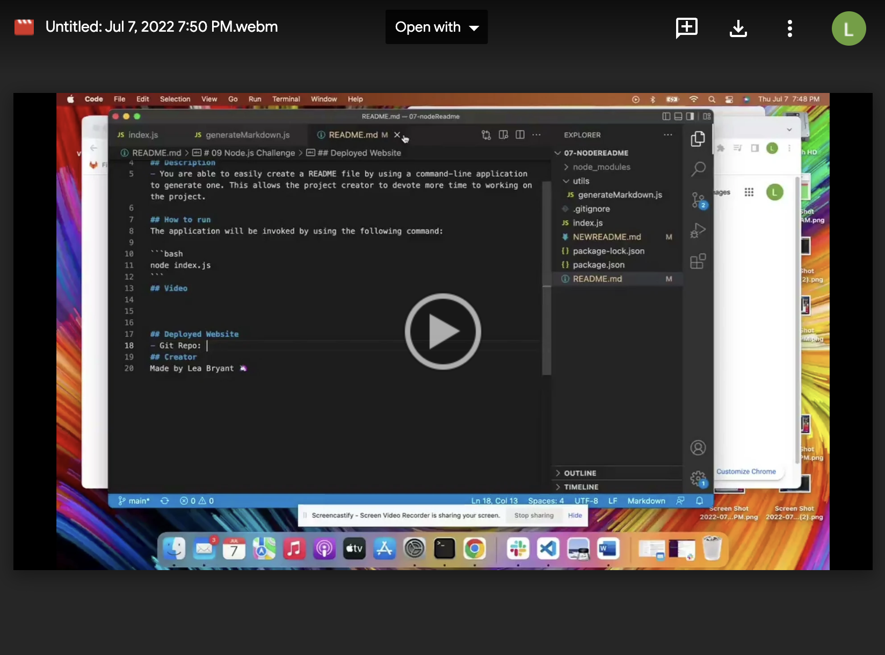

# 09 Node.js Challenge
Professional README Generator

## Description 
- You are able to easily create a README file by using a command-line application to generate one. This allows the project creator to devote more time to working on the project.

## How to run 
The application will be invoked by using the following command:

```bash
node index.js
```
## Video  


[Click on me to see the magic](https://drive.google.com/file/d/1cW7rfy7-_G1trtWToJfZ33JMaVTbq7-H/view)


## Deployed Website
- Git Repo: https://github.com/LeaBryant/07-nodeReadme
## Creator 
Made by Lea Bryant 🦄